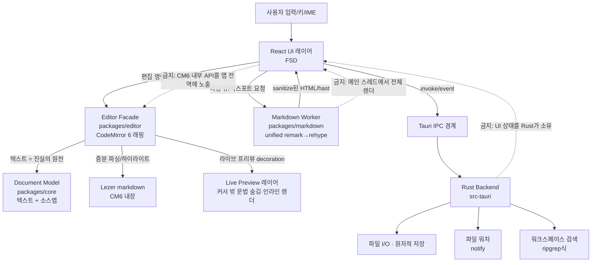

# 초기 아키텍처

이 에디터는 웹 셸(Tauri) 위에서 React UI를 렌더하고, 편집 표면으로 CodeMirror 6을 쓴다. 핵심 설계 목표는 **편집 엔진을 앱에서 분리**하고, **무거운 렌더/파싱을 메인 스레드 밖으로** 빼서, 타이핑이 어떤 상황에서도 막히지 않게 하는 것이다. 각 선택의 이유는 [설계 의사결정 기록](decisions.md)을 단일 출처로 둔다.

## 레이어 개요

```text
사용자 입력
  -> React UI (FSD: app/pages/widgets/features/entities/shared)
  -> Editor Facade (packages/editor, CM6 래핑)  ── 편집(텍스트 원천)
  -> Markdown Worker (packages/markdown, unified) ── 리딩/익스포트 렌더(오프-메인)
  -> Tauri IPC (invoke/event)
  -> Rust Backend (src-tauri + crates): 파일 I/O, 워칭, 검색
```

## 아키텍처 다이어그램

핵심은 **UI가 편집 엔진을 직접 알지 않고 `Editor Facade`를 통해서만 쓰고**, **리딩 뷰 렌더가 별도 Worker에서 도는 것**이다. 진실의 원천은 항상 마크다운 텍스트 문자열이며(ADR-003), 프리뷰/리딩은 그 텍스트의 파생 뷰다.



금지 화살표는 "간접 상호작용 전면 금지"가 아니라, 내부 구현 세부(CM6 private state, Rust가 UI 상태 소유, 메인 스레드 전체 렌더)에 직접 결합하는 의존을 막는 것이다. 공개 facade·이벤트·IPC 계약을 통한 상호작용은 허용한다.

## 핵심 경계

```text
React UI (FSD)
  - 크롬: 사이드바/탭/커맨드 팔레트/상태바/설정
  - 편집 엔진을 Editor Facade로만 소비
  - 무거운 렌더를 Worker에 위임

Editor Facade (packages/editor)
  - CM6 EditorState/EditorView 소유
  - 라이브 프리뷰 decoration, 키맵, 마크다운 확장
  - 앱에는 좁은 인터페이스만 노출(교체 가능)

Document Model (packages/core)
  - 진실의 원천 = 마크다운 텍스트
  - 문서 식별자, dirty 상태, 소스맵
  - 에디터/파서와 독립(프레임워크 중립)

Markdown Pipeline (packages/markdown)
  - unified 파이프라인(remark→rehype→sanitize)
  - Worker 진입점 + 순수 함수 코어(테스트 가능)

Tauri Shell (src-tauri + crates)
  - 파일 I/O, 워칭, 검색, 창/메뉴
  - UI 상태를 소유하지 않음(복구 메타데이터만)
```

## 스레딩 모델

```text
메인 스레드(웹뷰):
  React 렌더 + CM6 편집 + IME
  -> 절대 블로킹 금지

Web Worker:
  unified 전체 렌더(리딩 뷰/익스포트)
  대용량 문서 통계/링크 추출

Rust 스레드(백엔드):
  파일 read/write/watch, 검색
  -> IPC 이벤트로 결과 전달
```

이 분리의 의도는 "타이핑 레이턴시"를 지키는 것이다. 편집은 메인 스레드의 CM6가 담당하되, 그 외 무거운 작업(전체 마크다운 렌더, 파일 스캔, 검색)은 Worker/Rust로 밀어낸다.

## 테스트 원칙

가능한 모든 영역에서 TDD를 기본값으로 둔다. 상세와 레이어별 E2E 정의는 [테스트 전략](testing-strategy.md)과 [검증 매트릭스](verification-matrix.md)를 단일 출처로 둔다. 각 테스트는 "이 동작이 사용자의 어떤 편집 경험을 지키는가", "실패하면 어느 레이어(UI/에디터/파서/IPC/Rust)를 의심하는가"에 답해야 한다.

## 관측 가능성 원칙

디버깅·로그·테스트·리플레이가 **같은 도메인 데이터**를 공유하게 설계한다. 편집 상태(문서 텍스트, 선택, decoration, dirty), 파서 출력(mdast/hast 스냅샷), IPC 이벤트를 임시 포맷이 아니라 재사용 가능한 스냅샷으로 남긴다. 초기 우선순위는 (1) 문서/선택 스냅샷, (2) IPC 이벤트 로그, (3) 실패 시 아티팩트(입력 텍스트 + 기대 렌더)다. 릴리스 빌드에서는 이 관측 기능이 hot path에 의미 있는 비용을 남기지 않아야 한다.

## 개발 순서

구체 순서는 [실제 구현 계획](implementation-plan.md)과 [초기 세로 슬라이스](initial-vertical-slice.md)를 단일 출처로 둔다. 요약하면: 모노레포·툴체인 스캐폴딩 → macOS 앱 실행 프로토타입(파일 열기/저장 + 최소 벤치) → 라이브 프리뷰 decoration → 리딩 뷰 Worker → 워크스페이스 → Windows/Linux 플랫폼 검증 순이다.
